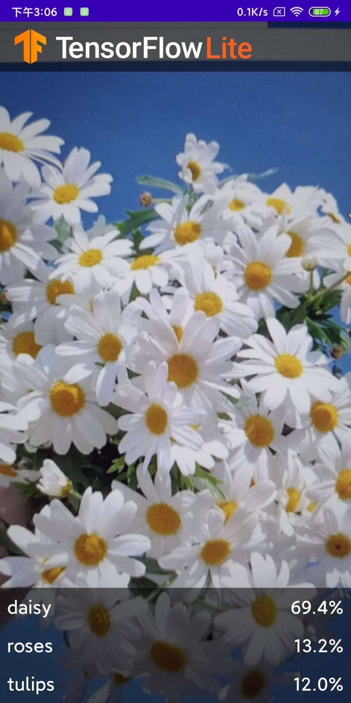

# 实现基本的图像分类APP
1. 从CSDN上下载源码。
[链接](https://blog.csdn.net/llfjfz/article/details/123899673)

2. 依照finish文件夹来补全start文件夹中缺失的代码块。

   start中缺失的代码为
```
private val flowerModel: FlowerModel by lazy{  
  
  // TODO 6. Optional GPU acceleration  
  val compatList = CompatibilityList()  
  
    val options = if(compatList.isDelegateSupportedOnThisDevice) {  
        Log.d(TAG, "This device is GPU Compatible ")  
        Model.Options.Builder().setDevice(Model.Device.GPU).build()  
    } else {  
        Log.d(TAG, "This device is GPU Incompatible ")  
        Model.Options.Builder().setNumThreads(4).build()  
    }  
  
    // Initialize the Flower Model  
  FlowerModel.newInstance(ctx, options)  
}

override fun analyze(imageProxy: ImageProxy) {  
  
            val items = mutableListOf<Recognition>()  
  
            // TODO 2: Convert Image to Bitmap then to TensorImage  
  val tfImage = TensorImage.fromBitmap(toBitmap(imageProxy))  
  
            // TODO 3: Process the image using the trained model, sort and pick out the top results  
  val outputs = flowerModel.process(tfImage)  
                .probabilityAsCategoryList.apply {  
  sortByDescending { it.score } // Sort with highest confidence first  
  }.take(MAX_RESULT_DISPLAY) // take the top results  
  
 // TODO 4: Converting the top probability items into a list of recognitions  
  for (output in outputs) {  
                items.add(Recognition(output.label, output.score))  
            }  
  
//            // START - Placeholder code at the start of the codelab. Comment this block of code out.  
//            for (i in 0 until MAX_RESULT_DISPLAY){  
//                items.add(Recognition("Fake label $i", Random.nextFloat()))  
//            }  
//            // END - Placeholder code at the start of the codelab. Comment this block of code out.  
  
 // Return the result  listener(items.toList())  
  
            // Close the image,this tells CameraX to feed the next image to the analyzer  
  imageProxy.close()  
        }
```
3. 将项目运行在真机上的运行效果为

